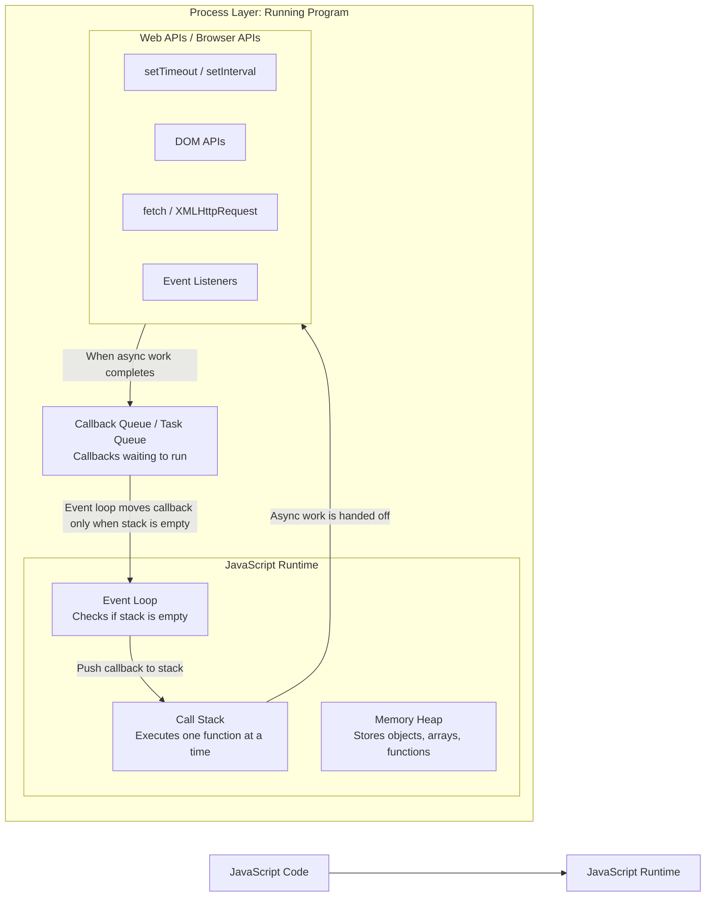

# JavaScript Runtime: Call Stack, Event Loop, Web APIs, and Queue

## Key Point

At any instant, the **JavaScript Call Stack executes only one function at a time**.

The stack can contain multiple stack frames, but only the **top frame** is actively running.

```text
Call Stack
┌─────────────────────────────┐
│ Currently running function  │  ← Only this runs now
├─────────────────────────────┤
│ Previous caller             │  ← Waiting
├─────────────────────────────┤
│ Older caller                │  ← Waiting
└─────────────────────────────┘
```

So the correct understanding is:

```text
Many functions can be inside the stack,
but only ONE function executes at a time.
```

---

# JavaScript Runtime Flow



---

# Simple Mental Model

```text
Process
 ├── JavaScript Runtime
 │    ├── Memory Heap
 │    ├── Call Stack
 │    └── Event Loop
 │
 ├── Web APIs / Browser APIs
 │    ├── Timers
 │    ├── DOM Events
 │    └── Network Requests
 │
 └── Callback Queue
      └── Waiting callbacks
```

---

# What Each Part Does

| Component               | Responsibility                                            |
| ----------------------- | --------------------------------------------------------- |
| Process                 | The running program/container that holds the runtime      |
| JavaScript Runtime      | Executes JavaScript code                                  |
| Memory Heap             | Stores objects, arrays, functions, and references         |
| Call Stack              | Runs synchronous code one function at a time              |
| Web APIs / Browser APIs | Handles async operations outside the call stack           |
| Callback Queue          | Stores completed async callbacks waiting to run           |
| Event Loop              | Moves callbacks to the call stack when the stack is empty |

---

# Important Rule

The event loop does **not** interrupt the currently running function.

It waits until the **Call Stack is empty**.

```text
If Call Stack is busy:
    callback waits in queue

If Call Stack is empty:
    event loop moves callback to stack
```

---

# Step-by-Step Flow

## Step 1: JavaScript code starts

```javascript
console.log("A");

setTimeout(() => {
  console.log("B");
}, 1000);

console.log("C");
```

---

## Step 2: Global code enters the Call Stack

```text
Call Stack
┌───────────────┐
│ Global Code   │
└───────────────┘
```

JavaScript starts executing line by line.

---

## Step 3: First synchronous line runs

```javascript
console.log("A");
```

Output:

```text
A
```

The call stack briefly looks like this:

```text
Call Stack
┌────────────────┐
│ console.log A  │  ← Running now
├────────────────┤
│ Global Code    │
└────────────────┘
```

After `console.log("A")` finishes, it is removed from the stack.

---

## Step 4: `setTimeout` is encountered

```javascript
setTimeout(() => {
  console.log("B");
}, 1000);
```

`setTimeout` does not block the call stack.

The timer is handed over to the Web APIs.

```text
Call Stack              Web APIs
┌───────────────┐       ┌────────────────────┐
│ Global Code   │ ----> │ setTimeout timer   │
└───────────────┘       └────────────────────┘
```

---

## Step 5: Next synchronous line runs

```javascript
console.log("C");
```

Output:

```text
C
```

The call stack briefly looks like this:

```text
Call Stack
┌────────────────┐
│ console.log C  │  ← Running now
├────────────────┤
│ Global Code    │
└────────────────┘
```

After this, global code finishes.

---

## Step 6: Call Stack becomes empty

```text
Call Stack
┌───────────────┐
│ Empty         │
└───────────────┘
```

---

## Step 7: Timer completes

After 1 second, the timer finishes in the Web API layer.

The callback is placed into the Callback Queue.

```text
Callback Queue
┌──────────────────────────────┐
│ () => console.log("B")       │
└──────────────────────────────┘
```

---

## Step 8: Event Loop checks the stack

The event loop asks:

```text
Is the Call Stack empty?
```

Since the stack is empty, it moves the callback into the Call Stack.

```text
Callback Queue          Call Stack
┌───────────────┐       ┌──────────────────────┐
│ Empty         │ ----> │ timeout callback     │
└───────────────┘       └──────────────────────┘
```

---

## Step 9: Callback runs

```javascript
console.log("B");
```

Output:

```text
B
```

---

# Final Output

```text
A
C
B
```

---

# Why Output Is Not A B C

Because `setTimeout` is asynchronous.

```javascript
console.log("A"); // runs immediately

setTimeout(() => {
  console.log("B"); // runs later
}, 1000);

console.log("C"); // runs immediately
```

So the order is:

```text
1. A runs first
2. setTimeout is handed to Web API
3. C runs next
4. Timer completes
5. Callback waits in queue
6. Event loop moves callback to stack
7. B runs last
```

---

# Clear Diagram

```text
┌───────────────────────────────────────────────────────────────┐
│                         PROCESS                               │
│                Your running JavaScript program                │
│                                                               │
│  ┌───────────────────────────────┐                            │
│  │      JAVASCRIPT RUNTIME        │                            │
│  │                               │                            │
│  │  ┌─────────────────────────┐  │                            │
│  │  │       MEMORY HEAP        │  │                            │
│  │  │ objects, arrays, funcs   │  │                            │
│  │  └─────────────────────────┘  │                            │
│  │                               │                            │
│  │  ┌─────────────────────────┐  │                            │
│  │  │       CALL STACK         │  │                            │
│  │  │ Executes ONE thing at    │  │                            │
│  │  │ a time                  │  │                            │
│  │  │                         │  │                            │
│  │  │ Top frame runs now      │  │                            │
│  │  │ Lower frames wait       │  │                            │
│  │  └─────────────────────────┘  │                            │
│  │                               │                            │
│  │  ┌─────────────────────────┐  │                            │
│  │  │       EVENT LOOP         │  │                            │
│  │  │ Checks if stack is empty │  │                            │
│  │  └─────────────────────────┘  │                            │
│  └───────────────────────────────┘                            │
│                                                               │
│  ┌───────────────────────────────┐                            │
│  │     WEB APIs / BROWSER APIs    │                            │
│  │ timers, DOM events, fetch      │                            │
│  └───────────────────────────────┘                            │
│                                                               │
│  ┌───────────────────────────────┐                            │
│  │        CALLBACK QUEUE          │                            │
│  │ callbacks waiting to run       │                            │
│  └───────────────────────────────┘                            │
│                                                               │
└───────────────────────────────────────────────────────────────┘
```

---

# Best Beginner Summary

JavaScript runs synchronous code inside the **Call Stack**.

The Call Stack can have multiple frames, but only the **top frame executes**.

Async work like timers, DOM events, and network calls are handled by **Web APIs**.

When async work is complete, its callback goes to the **Callback Queue**.

The **Event Loop** keeps checking:

```text
Is the Call Stack empty?
```

If yes, it moves the next callback from the queue into the call stack.

That is how JavaScript handles asynchronous behavior while still being single-threaded.
